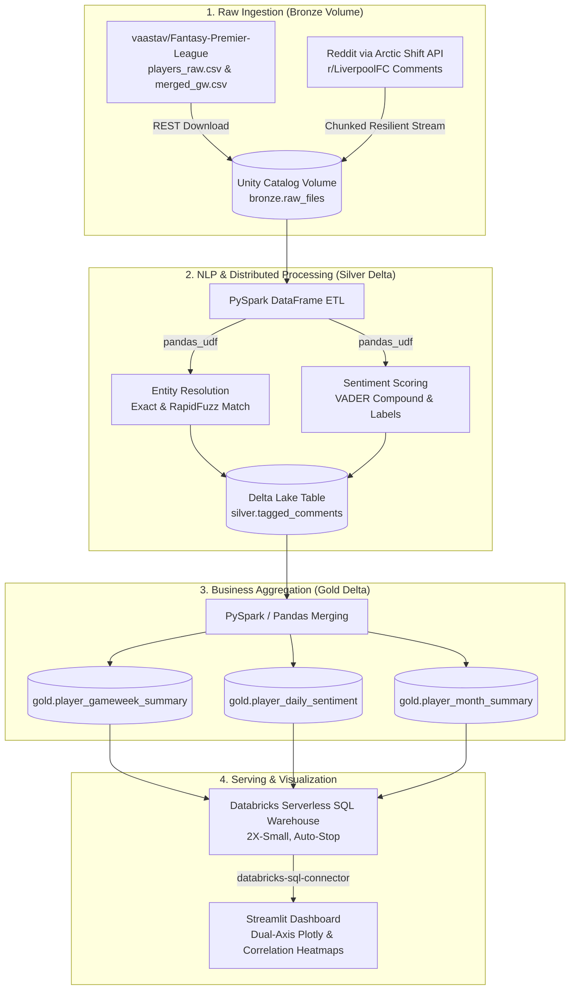

# Performance vs. Toxicity: On-Pitch Reality vs. Fan Sentiment

<div align="center">

[](https://www.python.org/)
[](https://azure.microsoft.com/en-us/products/databricks)
[](https://www.databricks.com/product/unity-catalog)
[](https://delta.io/)
[](https://spark.apache.org/docs/latest/api/python/)
[](https://azure.microsoft.com/en-us/products/storage/data-lake-storage/)
[](https://criticism-vs-performanc.streamlit.app/)
[](https://github.com/cjhutto/vaderSentiment)
[](https://plotly.com/)

</div>

> 🌐 **Live Dashboard**: [https://criticism-vs-performanc.streamlit.app/](https://criticism-vs-performanc.streamlit.app/)

An end-to-end Lakehouse and NLP pipeline investigating the empirical relationship between **on-pitch player performance** (Fantasy Premier League / FPL stats) and **fan sentiment & toxicity on Reddit** (`r/LiverpoolFC`) across two contrasting Premier League seasons:

- **2024-25** — Title-winning campaign (*Aug 16, 2024 – May 25, 2025*): High optimism and engagement (~100k+ comments).
- **2025-26** — 5th-place campaign (*Aug 15, 2025 – May 24, 2026*): Challenging season with elevated critical scrutiny.

---

## 🏛️ Architecture Overview

The system is built on a **Medallion Lakehouse Architecture** inside **Azure Databricks**, backed by **Azure Data Lake Storage Gen2 (ADLS Gen2)** and governed by **Unity Catalog**. Cleaned analytical data is served directly to an interactive **Streamlit** dashboard via a **Databricks Serverless SQL Warehouse**.

<p align="center">
  
</p>

<details>
<summary><b>🔍 View Mermaid Flowchart Code</b></summary>



</details>

---

## ☁️ Azure & Databricks Implementation Details

### 1. Storage & Security Architecture
- **Storage Layer**: Dedicated Azure Data Lake Storage Gen2 account (`criticismstorage2026`) containing isolated containers: `bronze`, `silver`, and `gold`.
- **Identity & Access**: Zero stored access keys or client secrets. Configured using an **Azure Databricks Access Connector** (Azure Managed Identity) granted the `Storage Blob Data Contributor` RBAC role on ADLS Gen2, referenced in Databricks as a **Unity Catalog Storage Credential**.
- **Data Governance**: Unity Catalog external locations govern container access and define catalog `performance_vs_toxicity` with managed schema locations (`bronze`, `silver`, `gold`).
- **Secrets Management**: Databricks Secret Scope backed by **Azure Key Vault** (`dbutils.secrets.get()`), while external client tokens (such as the Streamlit PAT) reside securely in **Streamlit Community Cloud Secrets** or local `.env`.

### 2. Medallion Data Flow

| Stage | Path / Object Name | Format | Description |
|---|---|---|---|
| **Bronze** | `performance_vs_toxicity.bronze.raw_files` | Raw CSV & JSONL | Ingests raw FPL CSVs and Reddit JSONL comments into a Unity Catalog Volume. Built with checkpoint resume and cooldown backoff for API resilience. |
| **Silver** | `performance_vs_toxicity.silver.tagged_comments` | Delta Lake | Explodes comments by identified player mentions. Scores sentiment per comment using distributed `pandas_udf` (VADER + word-boundary & RapidFuzz entity matching). |
| **Gold** | `performance_vs_toxicity.gold.player_gameweek_summary`<br/>`performance_vs_toxicity.gold.player_daily_sentiment`<br/>`performance_vs_toxicity.gold.player_month_summary` | Delta Lake | Multi-granularity aggregated metrics: joins on-pitch stats (points, goals, assists, minutes, opponent, home/away) with fan criticism (`avg_sentiment`, `n_comments`, `negative_share`). |

### 3. Orchestration & Serving
- **Databricks Workflow / Job**: The long-running, rate-limited Bronze ingestion runs inside a scheduled Databricks Job with automated retries and status logging.
- **Interactive Development**: Silver and Gold transformation notebooks are modular, enabling iterative execution during analysis or chaining as downstream job tasks.
- **Serverless SQL Warehouse**: A 2X-Small Serverless SQL Warehouse with aggressive auto-stop executes live analytical queries on Gold Delta tables with sub-second response times.

---

## 📊 Streamlit Dashboard Features

The web dashboard ([criticism-vs-performanc.streamlit.app](https://criticism-vs-performanc.streamlit.app/)) provides an intuitive visual interface built with `dashboard/app.py`:

- **Multi-Granularity Analysis**: Toggle between **Matchweek view** (aligns sentiment directly with FPL gameweek fixtures) and **Daily view** (tracks sentiment trends between games).
- **Dual-Axis Performance vs. Criticism**: Compares player fantasy points against average Reddit sentiment over time, color-coded by season.
- **Dynamic Correlation Matrices**: Generates interactive Pearson correlation heatmaps (`total_points`, `goals_scored`, `assists`, `minutes`, `avg_sentiment`, `n_comments`, `negative_share`).
- **Cross-Season Player Filtering**: Automatically filters to players active across both seasons for fair longitudinal comparison.
- **Resilient Connectivity**: Built-in caching (`st.cache_data`) and friendly error handling for token lifecycle management.

---

## 🚀 Getting Started & Execution Modes (in Azure Databricks)

1. Clone this repository into your Databricks Workspace (**Databricks Repos / Git Folders**).
2. Execute `notebooks/00_setup.ipynb` to create the catalog, schemas, and volume.
3. Execute `notebooks/01_bronze_ingest.ipynb` to ingest FPL and Reddit data.
4. Execute `notebooks/02_silver_transform.ipynb` to process comments into the Silver Delta table.
5. Execute `notebooks/03_gold_aggregate.ipynb` to generate the Gold Delta tables.
6. Configure your local `.env` (or Streamlit Cloud secrets):
   ```env
   DATABRICKS_SERVER_HOSTNAME=<your-databricks-instance>.azuredatabricks.net
   DATABRICKS_HTTP_PATH=/sql/1.0/warehouses/<warehouse-id>
   DATABRICKS_TOKEN=<your-personal-access-token>
   ```
7. Launch the dashboard:
   ```bash
   streamlit run dashboard/app.py
   ```

---

## 🧪 Testing

Run the test suite covering entity resolution, sentiment scoring, and ingestion pagination:

```bash
pytest tests/ -v
```

---

## 📁 Repository Structure

```
criticism-vs-performance/
├── config/
│   └── seasons.yaml                # Season date boundaries, team name, and API parameters
├── data/                           # Local data directory (raw / silver / gold)
├── dashboard/
│   └── app.py                      # Streamlit dashboard querying Databricks SQL Warehouse
├── notebooks/                      # Azure Databricks Lakehouse notebooks
│   ├── 00_setup.ipynb              # Environment, Unity Catalog, schemas & volumes DDL
│   ├── 01_bronze_ingest.ipynb      # FPL & Arctic Shift Reddit ingestion into Bronze Volume
│   ├── 02_silver_transform.ipynb   # Distributed PySpark entity matching & VADER sentiment
│   └── 03_gold_aggregate.ipynb     # Multi-granularity Delta Gold aggregations & correlation tests
├── report/                         # Statistical analysis, charts & empirical findings
│   ├── 01_season_sentiment_distribution.png
│   ├── 02_performance_vs_sentiment_scatter.png
│   ├── 03_correlation_matrix_heatmap.png
│   ├── 04_player_sentiment_praise_vs_criticism.png
│   ├── 05_gameweek_trajectory_comparison.png
│   ├── 06_scapegoat_quadrant_analysis.png
│   ├── 07_home_away_fixture_impact.png
│   ├── 08_new_signings_scrutiny.png
│   ├── analysis_metrics.json        # Computed metrics, p-values & player correlations
│   └── README.md                   # Full empirical findings & analysis report
├── scripts/
│   ├── generate_report.py          # Generates report charts and statistical metrics
│   └── make_demo_reddit_data.py    # Generates synthetic labeled comments for local testing
├── src/
│   ├── aggregation/
│   │   └── merge_performance_sentiment.py # Joins FPL metrics with sentiment aggregations
│   ├── classification/
│   │   └── sentiment_baseline.py   # VADER compound scoring and sentiment categorization
│   ├── common/
│   │   └── config.py               # YAML configuration loader and path helpers
│   ├── entity_resolution/
│   │   └── player_matcher.py       # Exact token & RapidFuzz player name matching
│   ├── ingestion/
│   │   ├── fetch_fpl_season.py     # Downloads FPL player and gameweek CSVs
│   │   └── fetch_reddit_dump.py    # Resilient Arctic Shift Reddit comment harvester
│   └── pipeline_tag_and_score.py   # Local end-to-end silver processing runner
├── tests/                          # Unit and integration test suite
├── requirements.txt                # Python package dependencies
└── README.md                       # Project documentation
```

---

## 🔍 Methodological Notes & Limitations

- **Entity Resolution**: Player aliases are built from official FPL rosters with custom alias overrides (`A.Becker` &rarr; `alisson`, `Luis Díaz` &rarr; `diaz`). Unnamed criticism (e.g., *"the defense was terrible"*) is excluded from individual player attribution.
- **VADER Sentiment Baseline**: Chosen deliberately as a fast, interpretable, zero-shot lexical baseline. For domain-specific football fan jargon (e.g., *"unreal performance"*, *"he cooked"*), future iterations can leverage domain fine-tuned LLMs or RoBERTa models.
- **Statistical Significance**: Months or matchweeks with low comment volume (`n_comments < 5`) should be interpreted cautiously; the dashboard highlights sample sizes across all visual cards.
- **Public API Rate Limits**: Arctic Shift is a free public archive; the ingestion pipeline embeds exponential backoff, checkpoint recovery, and request throttling to ensure resilient data extraction.
