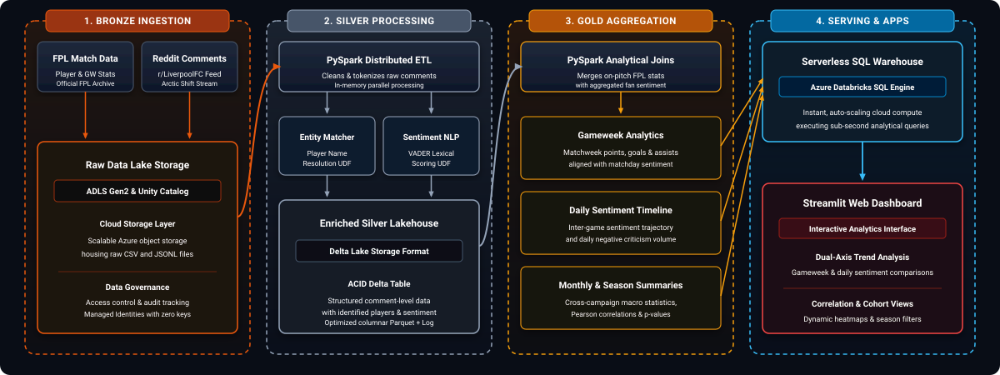

<div align="center">

# Performance vs. Toxicity: On-Pitch Reality vs. Fan Sentiment

[](https://www.python.org/)
[](https://azure.microsoft.com/en-us/products/databricks)
[](https://www.databricks.com/product/unity-catalog)
[](https://delta.io/)
[](https://spark.apache.org/docs/latest/api/python/)
[](https://azure.microsoft.com/en-us/products/storage/data-lake-storage/)
[](https://criticism-vs-performanc.streamlit.app/)
[](https://github.com/cjhutto/vaderSentiment)
[](https://plotly.com/)

**Live Dashboard**: [https://criticism-vs-performanc.streamlit.app/](https://criticism-vs-performanc.streamlit.app/)

</div>

---

## Overview

An end-to-end Lakehouse and NLP pipeline investigating the empirical relationship between **on-pitch player performance** (Fantasy Premier League / FPL stats) and **fan sentiment & toxicity on Reddit** (`r/LiverpoolFC`) across two contrasting Premier League seasons:

- **2024-25**: Title-winning campaign (*Aug 16, 2024 – May 25, 2025*): Sustained positive momentum.
- **2025-26**: 5th-place campaign (*Aug 15, 2025 – May 24, 2026*): Transitional season with elevated scrutiny.

---

## Architecture Overview

The system is built on a **Medallion Lakehouse Architecture** inside **Azure Databricks**, backed by **Azure Data Lake Storage Gen2 (ADLS Gen2)** and governed by **Unity Catalog**. Analytical data is served directly to an interactive **Streamlit** dashboard via a **Databricks Serverless SQL Warehouse**.

<p align="center">
  
</p>

---

## Azure & Databricks Implementation Details

### 1. Storage & Security Architecture
- **Storage Layer**: Dedicated Azure Data Lake Storage Gen2 account (`criticismstorage2026`) containing isolated containers: `bronze`, `silver`, and `gold`.
- **Identity & Access**: Managed Identity via **Azure Databricks Access Connector** with `Storage Blob Data Contributor` RBAC on ADLS Gen2, referenced in Databricks as a **Unity Catalog Storage Credential**.
- **Data Governance**: Unity Catalog external locations govern container access and define catalog `performance_vs_toxicity` with managed schema locations (`bronze`, `silver`, `gold`).
- **Secrets Management**: Databricks Secret Scope backed by **Azure Key Vault** (`dbutils.secrets.get()`), while external client tokens reside in **Streamlit Community Cloud Secrets** or local `.env`.

### 2. Medallion Data Flow

| Stage | Object Name | Format | Description |
| :--- | :--- | :--- | :--- |
| **Bronze** | `performance_vs_toxicity.bronze.raw_files` | Raw CSV & JSONL | Ingests raw FPL CSVs and Reddit JSONL comments into a Unity Catalog Volume. Built with checkpoint resume and cooldown backoff for API resilience. |
| **Silver** | `performance_vs_toxicity.silver.tagged_comments` | Delta Lake | Explodes comments by identified player mentions. Scores sentiment per comment using distributed `pandas_udf` (VADER + word-boundary & RapidFuzz entity matching). |
| **Gold** | `performance_vs_toxicity.gold.player_gameweek_summary`<br/>`performance_vs_toxicity.gold.player_daily_sentiment`<br/>`performance_vs_toxicity.gold.player_month_summary` | Delta Lake | Multi-granularity aggregated metrics: joins on-pitch stats (points, goals, assists, minutes, opponent, home/away) with fan criticism (`avg_sentiment`, `n_comments`, `negative_share`, `z-scores`). |

### 3. Orchestration & Serving
- **Databricks Workflow / Job**: Long-running Bronze ingestion runs inside a scheduled Databricks Job with automated retries.
- **Interactive Development**: Modular Silver and Gold transformation notebooks for interactive experimentation.
- **Serverless SQL Warehouse**: 2X-Small Serverless SQL Warehouse with auto-stop executes live analytical queries on Gold Delta tables with sub-second response times.

---

## Streamlit Dashboard Features

The web dashboard ([criticism-vs-performanc.streamlit.app](https://criticism-vs-performanc.streamlit.app/)) provides an intuitive visual interface:

- **Multi-Granularity Analysis**: Toggle between **Matchweek view** (aligned with FPL fixtures) and **Daily view** (inter-match trends).
- **Metric View Modes**: Raw FPL Points, Z-Score Standardized View, Upvote-Weighted Sentiment, and Points Per 90.
- **Dynamic Correlation Matrices**: Interactive Pearson correlation heatmaps across on-pitch and sentiment metrics.
- **Low-Sample Filter**: Ability to filter out sparse gameweeks ($N < 3$ comments).
- **Cross-Season Player Filtering**: Automatically filters to players active across both seasons for fair longitudinal comparison.

---

## Getting Started & Execution Modes

### In Azure Databricks:
1. Clone this repository into your Databricks Workspace (**Databricks Repos / Git Folders**).
2. Execute `notebooks/00_setup.ipynb` to create the catalog, schemas, and volume.
3. Execute `notebooks/01_bronze_ingest.ipynb` to ingest FPL and Reddit data.
4. Execute `notebooks/02_silver_transform.ipynb` to process comments into the Silver Delta table.
5. Execute `notebooks/03_gold_aggregate.ipynb` to generate the Gold Delta tables.

### Local Execution:
1. Install dependencies: `pip install -r requirements.txt`
2. Run test suite: `python -m pytest tests/`
3. Launch dashboard: `streamlit run dashboard/app.py`

---

## Repository Structure

```text
criticism-vs-performance/
├── config/                         # Configuration files (seasons.yaml)
├── data/                           # Local data directory (raw / silver / gold)
├── dashboard/                      # Streamlit interactive application
│   └── app.py
├── notebooks/                      # Azure Databricks Lakehouse notebooks
│   ├── 00_setup.ipynb
│   ├── 01_bronze_ingest.ipynb
│   ├── 02_silver_transform.ipynb
│   └── 03_gold_aggregate.ipynb
├── report/                         # Statistical analysis, charts & empirical findings
│   ├── figures/                    # 300 DPI high-resolution figures & SVGs
│   ├── analysis_metrics.json       # Computed metrics, p-values & player correlations
│   └── README.md                   # Full empirical findings & analysis report
├── scripts/                        # Automation & generation utilities
│   ├── generate_report.py
│   └── make_demo_reddit_data.py
├── src/                            # Core ETL & NLP logic
│   ├── aggregation/
│   ├── classification/
│   ├── common/
│   ├── entity_resolution/
│   └── ingestion/
├── tests/                          # Pytest unit and integration test suite
├── requirements.txt
└── README.md
```

---

## Methodological Notes & Limitations

- **Entity Resolution**: Player aliases built from official FPL rosters with custom alias overrides (`A.Becker` -> `alisson`, `Luis Díaz` -> `diaz`). Unnamed general criticism is excluded from individual player attribution.
- **VADER Sentiment Baseline**: Fast, interpretable lexical baseline enriched with football-specific terminology (30+ domain tokens and phrasal negations).
- **Statistical Significance**: Gameweeks with low comment volume ($N < 3$) are flagged with `low_sample_flag` to prevent small-sample distortion.
- **Public API Rate Limits**: Reddit ingestion incorporates exponential backoff, checkpoint recovery, and request throttling.
